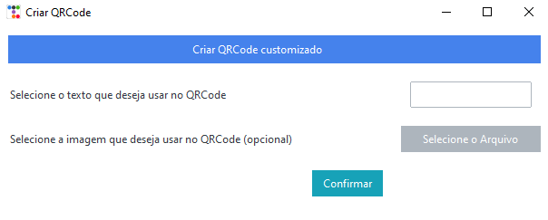

# Gerador de QRCode

## Sobre
Gerador de QRCode com ou sem imagem feito com ttkbootstrap

##  Pré-requisitos
* python 3.11.x
* ``pip install -r requirements.txt``

## Usando o Gerador
* ``python main.py``
* Selecione o link/texto que deseja colocar no QRCode
* Clique em Confirmar e o QRCode irá abrir

* Ou use o .exe